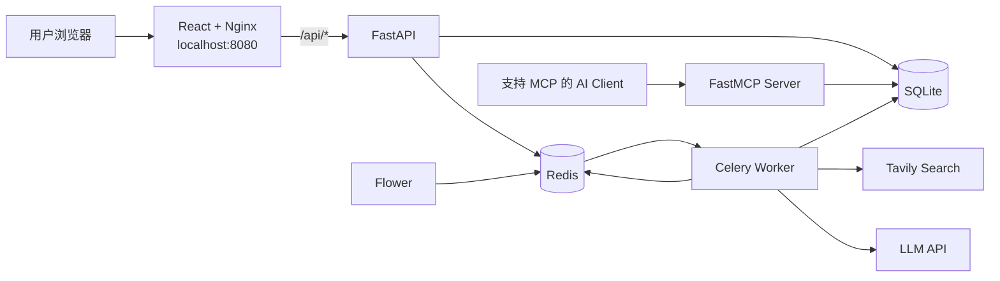

# 企业多 Agent 研究报告助手

一个面向企业研究场景的全栈 AI 应用。

用户提交研究主题后，系统将长任务投递到后台队列，由 Planner、Researcher、Analyst、Reviewer、Writer 五个 Agent 协作完成任务规划、资料检索、证据提取、结论分析、证据审核和最终报告生成。

最终输出结构化研究报告，并建立“报告章节 → Claim → Evidence → Source URL”的可追溯链路。

## 项目解决的问题

企业研究任务通常存在以下问题：

- 人工检索资料耗时，且来源质量不稳定；
- 大模型直接生成报告时，容易产生无来源结论或来源幻觉；
- 研究任务耗时较长，不适合让 HTTP 请求同步等待；
- 任务失败后难以定位具体 Agent、执行阶段和错误原因；
- 后端即使生成报告，用户也缺少直观的执行进度与来源阅读体验；
- AI 能力通常只能通过固定前端访问，难以被其他 AI Client 标准化接入。

本项目通过多 Agent 工作流、结构化 Schema、证据约束、Redis、Celery、React、Docker Compose 和 MCP Server 解决这些问题。

## 核心能力

- LangGraph 编排 Planner、Researcher、Analyst、Reviewer、Writer 多 Agent 工作流；
- Planner 将研究主题拆解为可执行子任务；
- Researcher 支持查询改写、多查询检索、RRF 融合、URL 去重与证据提取；
- Evidence Extraction 只能从真实检索结果中选择来源 URL，避免模型编造来源；
- Analyst 基于 Evidence 生成结构化 Claim；
- Reviewer 校验 Claim 与 Evidence 的一致性；
- Writer 仅使用审核通过的 Claim 生成最终报告；
- Report Section → Claim → Evidence → Source URL 形成可追溯链路；
- Redis 缓存 Tavily 搜索结果，并在 Redis 故障时 fail-open 降级；
- Celery + Redis 将长任务从同步 HTTP 请求迁移到后台 Worker；
- WorkflowRun、AgentRun、任务状态机记录执行轨迹、耗时、Token、成本和错误；
- React 前端展示任务创建、Agent 执行状态、最终报告和可点击来源；
- Nginx 提供 Docker 化前端，并将 `/api/*` 反向代理到 FastAPI；
- MCP Server 将任务、报告和审计能力标准化开放给 AI Client；
- Pytest 与 GitHub Actions CI 提供回归测试保护。

## 系统架构



## 多 Agent 工作流

```text
PENDING
  ↓
QUEUED
  ↓
PLANNING      → Planner：拆解研究目标与子任务
  ↓
RESEARCHING   → Researcher：检索、查询改写、证据提取
  ↓
ANALYZING     → Analyst：将证据转化为结构化 Claim
  ↓
REVIEWING     → Reviewer：核验 Claim 与 Evidence 的一致性
  ↓
WRITING       → Writer：仅使用审核通过的 Claim 生成报告
  ↓
COMPLETED
```

任何阶段发生异常，任务会进入 `FAILED`，并持久化错误信息与执行记录。

## 证据可追溯设计

项目不直接相信模型生成的来源链接，而是建立以下约束：

```text
Tavily 检索结果
  ↓
Evidence Extraction 仅选择真实检索结果中的 URL
  ↓
服务端从实际检索文本中生成 evidence excerpt
  ↓
Analyst 只能基于 Evidence 创建 Claim
  ↓
Reviewer 审核 Claim 与 Evidence
  ↓
Writer 只能使用 APPROVED Claim
  ↓
Report Citation 绑定 Evidence ID
  ↓
前端 / MCP 返回真实来源标题与 URL
```

该设计降低了“模型编造引用来源”的风险，并支持对最终结论进行来源追溯。

## MCP Server

项目提供一个基于 FastMCP 的本地 MCP Server：

```text
app/mcp_server.py
```

MCP 层不直接操作 ORM，而是复用现有 Service 和 Repository 分层，因此 FastAPI、Celery Worker、React 前端和 MCP Client 共享同一套业务规则与 SQLite 数据。

### MCP Tools

| Tool | 用途 |
|---|---|
| `get_research_task` | 查询任务状态、主题、要求与失败信息 |
| `get_final_report` | 查询最终报告、Markdown 内容和引用来源 |
| `get_execution_trace` | 查询 WorkflowRun、AgentRun、耗时、Token、成本与错误 |

### MCP Resource

```text
research://tasks/{task_id}/summary
```

该 Resource Template 为外部 AI Client 提供可通过 URI 读取的只读任务摘要。

示例：

```text
research://tasks/2a73a041-3048-4301-9c78-73d920ed424d/summary
```

### MCP Prompt

```text
review_research_report
```

该 Prompt 为客户端 LLM 提供标准化的报告审阅指令，要求：

- 查询任务状态；
- 读取最终报告与来源；
- 读取多 Agent 执行审计轨迹；
- 面向企业管理者输出结论、风险、建议和局限性；
- 不得编造来源；
- 明确低质量证据或资料不足导致的不确定性。

### 启动 MCP Inspector

在项目根目录执行：

```powershell
npx --yes @modelcontextprotocol/inspector .\.venv\Scripts\python.exe -m app.mcp_server
```

浏览器打开 Inspector 后，可验证：

- `Tools`：查看和调用三个查询 Tool；
- `Resources`：读取任务摘要 Resource；
- `Prompts`：获取报告审阅 Prompt。

## 技术栈

| 分类 | 技术 |
|---|---|
| 后端 API | FastAPI、Pydantic |
| AI 编排 | LangGraph、LangChain |
| 模型调用 | OpenAI 兼容 API |
| 网页检索 | Tavily |
| 数据库 | SQLite、SQLAlchemy |
| 缓存与消息队列 | Redis |
| 长任务异步化 | Celery |
| 工作流监控 | Flower |
| MCP | FastMCP、MCP Inspector |
| 前端 | React、Vite |
| 前端 Web Server | Nginx |
| 容器化 | Docker、Docker Compose |
| 测试 | Pytest |
| CI | GitHub Actions |

## 本地运行

### 1. 创建并激活虚拟环境

```powershell
python -m venv .venv
.\.venv\Scripts\Activate.ps1
```

### 2. 安装依赖

```powershell
.\.venv\Scripts\python.exe -m pip install -r requirements.txt
.\.venv\Scripts\python.exe -m pip install -r requirements-dev.txt
```

### 3. 配置环境变量

复制示例文件：

```powershell
Copy-Item .env.example .env
```

然后在 `.env` 中填写：

```text
LLM_API_KEY=你的模型服务密钥
LLM_MODEL=你的模型名称
LLM_BASE_URL=你的模型服务地址
TAVILY_API_KEY=你的 Tavily 密钥
```

### 4. 启动 Redis

```powershell
docker compose up -d redis
```

### 5. 启动 FastAPI

```powershell
.\.venv\Scripts\python.exe -m uvicorn app.main:app --reload
```

API 文档地址：

```text
http://127.0.0.1:8000/docs
```

### 6. 启动 Celery Worker

新开一个终端：

```powershell
.\.venv\Scripts\python.exe -m celery -A app.core.celery_app:celery_app worker --loglevel=INFO --pool=solo
```

### 7. 启动前端开发服务

新开一个终端：

```powershell
cd frontend
npm install
npm run dev
```

前端开发地址：

```text
http://localhost:5173
```

## Docker Compose 运行

确保 `.env` 已填写真实密钥后，在项目根目录执行：

```powershell
docker compose up --build
```

服务地址：

| 服务 | 地址 |
|---|---|
| React 前端 | `http://localhost:8080` |
| FastAPI 文档 | `http://localhost:8000/docs` |
| Flower 监控 | `http://localhost:5555` |
| 健康检查 | `http://localhost:8080/api/health` |

停止服务：

```powershell
docker compose down
```

## 测试

运行所有测试：

```powershell
.\.venv\Scripts\python.exe -m pytest -q
```

测试覆盖：

- 任务状态机；
- 结构化 Schema Guardrails；
- Redis 缓存与 fail-open；
- WorkflowRun 状态与耗时；
- MCP 输入校验；
- MCP Prompt 约束；
- MCP 查询函数的结构化失败结果。

## 项目目录

```text
14.MultiAgent_Research_Agent/
├── app/
│   ├── agents/                 # 多 Agent 定义
│   ├── api/                    # FastAPI 路由
│   ├── clients/                # LLM、Redis、Tavily 客户端
│   ├── core/                   # 配置、数据库、Celery
│   ├── graphs/                 # LangGraph 工作流
│   ├── models/                 # SQLAlchemy 模型
│   ├── repositories/           # 数据访问层
│   ├── schemas/                # Pydantic Schema
│   ├── services/               # 业务服务层
│   ├── tasks/                  # Celery 后台任务
│   └── mcp_server.py           # MCP Server 入口
├── frontend/                   # React + Vite + Nginx 前端
├── tests/                      # Pytest 测试
├── docs/                       # 设计与学习文档
├── Dockerfile
├── docker-compose.yml
├── requirements.txt
└── README.md
```

## 面试亮点

1. 多 Agent 职责边界清晰：规划、检索、分析、审核、成文分离；
2. 通过结构化 Schema 和 Evidence 约束降低来源幻觉；
3. 使用 Celery + Redis 处理长任务，避免同步 HTTP 超时；
4. 通过 WorkflowRun、AgentRun 记录执行轨迹、耗时、Token、成本和失败原因；
5. React 前端展示多 Agent 实时阶段和最终可追溯报告；
6. 使用 Docker Compose 一键启动前端、API、Worker、Redis 和 Flower；
7. 使用 MCP Tool、Resource、Prompt 将应用能力标准化开放给外部 AI Client；
8. MCP 层复用 Service / Repository，避免协议接入导致业务规则分叉；
9. 使用 Pytest 和 GitHub Actions 防止回归。

## 后续可演进方向

- SQLite 迁移至 PostgreSQL，并使用 Alembic 管理数据库迁移；
- Redis Queue、Celery 重试策略和死信队列；
- Hybrid Search、向量检索与 Rerank；
- MCP Streamable HTTP、认证授权与多租户隔离；
- 任务进度 SSE 或 WebSocket 推送；
- GitHub Actions 自动构建 Docker 镜像；
- 云端部署与日志监控。