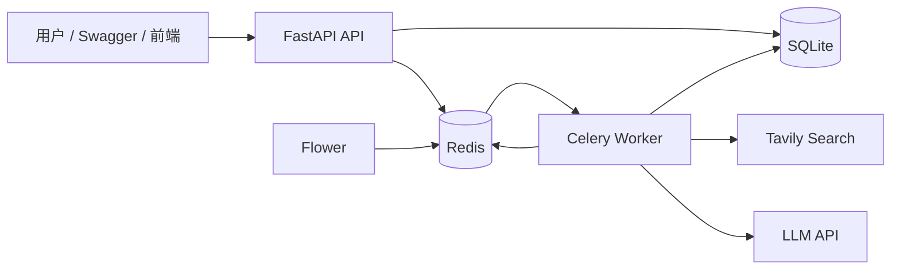
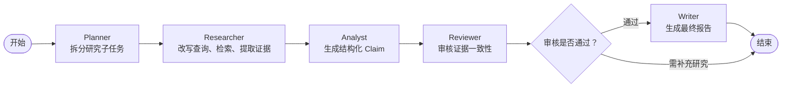

# 企业多 Agent 研究报告助手

一个面向企业研究场景的 AI 应用：用户提交研究主题后，系统通过多 Agent 协作完成任务规划、网页检索、证据提取、结论分析、证据审核和报告生成，并输出可追溯来源的研究报告。

## 1. 业务问题

企业研究任务通常存在以下问题：

- 人工检索资料耗时长，且来源质量不稳定；
- LLM 直接生成报告容易出现无来源结论或幻觉；
- 长耗时任务不适合由 HTTP 请求同步等待；
- 任务失败后缺少可定位的执行轨迹和错误信息。

本项目通过多 Agent 工作流、Evidence 约束、异步队列和执行审计解决这些问题。

## 2. 核心能力

- LangGraph 编排 Planner、Researcher、Analyst、Reviewer、Writer 多 Agent 工作流；
- Planner 将研究主题拆分为多个可执行子任务；
- Researcher 支持查询改写、多查询并发检索、URL 去重和 RRF 融合；
- Evidence Extraction 只允许选择真实检索到的 URL；
- 服务端从真实检索内容生成证据原文摘录，避免模型伪造来源；
- Analyst 基于 Evidence 生成结构化 Claim；
- Reviewer 对 Claim 与 Evidence 的一致性进行审核；
- Writer 仅使用审核通过的 Claim 生成最终报告；
- Redis 缓存 Tavily 检索结果，降低重复检索成本；
- Celery + Redis 将长任务从同步 HTTP 请求迁移到后台 Worker；
- WorkflowRun、AgentRun、任务状态机提供执行审计；
- Docker Compose 一键启动 API、Worker、Redis 和 Flower；
- Pytest + GitHub Actions CI 提供回归测试保护。

## 3. 系统架构



## 4. 多 Agent 工作流



## 5. 技术栈

| 分类 | 技术 |
|---|---|
| Web API | FastAPI、Pydantic |
| 多 Agent 编排 | LangGraph、LangChain |
| 大模型 | OpenAI 兼容接口 |
| 网页检索 | Tavily |
| 关系数据 | SQLite、SQLAlchemy |
| 缓存与消息队列 | Redis |
| 异步任务 | Celery |
| 任务监控 | Flower |
| 容器化 | Docker、Docker Compose |
| 测试 | Pytest |
| CI | GitHub Actions |

## 6. 数据与职责边界

| 数据 | 保存位置 | 说明 |
|---|---|---|
| 研究任务、子任务、Evidence、Claim、Report | SQLite | 长期业务事实与审计数据 |
| AgentRun | SQLite | 单个 Agent 的执行、Token 和耗时记录 |
| WorkflowRun | SQLite | 完整后台工作流的排队、执行和失败记录 |
| Tavily 搜索缓存 | Redis DB 0 | 可丢失、可重建的短期缓存 |
| Celery Broker | Redis DB 1 | 等待 Worker 消费的任务消息 |
| Celery Result Backend | Redis DB 2 | Celery 实时技术状态和返回值 |

## 7. 本地启动

### 7.1 配置环境变量

复制示例文件：

```powershell
Copy-Item .env.example .env
```

在 `.env` 中填写：

```text
LLM_API_KEY=你的模型API_KEY
LLM_MODEL=你的模型名称
LLM_BASE_URL=模型服务商地址
TAVILY_API_KEY=你的Tavily_API_KEY
```

`.env` 已被 `.gitignore` 忽略，不应提交到 GitHub。

### 7.2 使用 Docker Compose 启动

```powershell
docker compose up --build -d
```

查看服务状态：

```powershell
docker compose ps
```

查看 API 日志：

```powershell
docker compose logs -f api
```

查看 Celery Worker 日志：

```powershell
docker compose logs -f worker
```

### 7.3 访问地址

| 服务 | 地址 |
|---|---|
| Swagger API 文档 | http://127.0.0.1:8000/docs |
| 健康检查 | http://127.0.0.1:8000/health |
| Flower 监控面板 | http://127.0.0.1:5555 |

## 8. 典型使用流程

1. 调用 `POST /research-tasks` 创建研究任务；
2. 调用 `POST /research-tasks/{task_id}/run`；
3. API 立即返回 `202 Accepted`、`celery_task_id` 和 `workflow_run_id`；
4. 调用 `GET /research-tasks/{task_id}` 查询业务状态；
5. 调用 `GET /research-tasks/{task_id}/workflow-runs` 查询后台执行历史；
6. 调用 `GET /background-tasks/{celery_task_id}` 查询 Celery 技术状态；
7. 任务完成后调用 `GET /research-tasks/{task_id}/report` 获取研究报告。

## 9. 状态设计

### 研究任务业务状态

```text
PENDING
→ QUEUED
→ PLANNING
→ RESEARCHING
→ ANALYZING
→ REVIEWING
→ WRITING
→ COMPLETED
```

任何非终态都可以在异常时进入：

```text
FAILED
```

### 工作流执行状态

```text
QUEUED
→ RUNNING
→ SUCCEEDED

QUEUED / RUNNING
→ FAILED
```

`ResearchTask.status` 描述研究业务进行到哪个阶段；`WorkflowRun.status` 描述一次 Celery 执行尝试的生命周期；两者不能混用。

## 10. 测试

本地运行：

```powershell
python -m pytest -q
```

容器内运行：

```powershell
docker compose exec api python -m pytest -q
```

当前测试覆盖：

- Query Rewrite Schema 归一化；
- Evidence 类型别名与 URL 去重；
- Reviewer 审核一致性保护；
- Analyst 输出数量限制；
- Redis 缓存命中与 Redis 故障降级；
- LangGraph 主流程与审核分支；
- WorkflowRun 状态机与执行耗时。

GitHub Actions 会在每次 Push 或 Pull Request 时自动运行语法检查与测试。

## 11. 关键工程设计

### 11.1 防止来源幻觉

模型不能自行编造证据 URL。

Evidence Extraction Agent 只能从 Tavily 返回的候选 URL 中选择；服务端从真实检索文本生成 `content_excerpt`，建立：

```text
Report Section
→ Claim
→ Evidence
→ Source URL
```

的可追溯链路。

### 11.2 长任务异步化

研究任务可能持续数分钟，因此 API 不同步等待工作流结束。

```text
FastAPI 接收任务
→ 返回 202 Accepted
→ Redis Broker
→ Celery Worker 执行 LangGraph
→ SQLite 持久化状态与报告
```

### 11.3 Redis Fail-open 缓存

Tavily 搜索结果采用 Cache Aside 模式：

```text
优先读取 Redis
→ 未命中时调用 Tavily
→ 成功后写入 Redis
```

Redis 不可用时，系统自动绕过缓存并调用 Tavily，避免缓存服务成为单点故障。

## 12. 当前限制与后续计划

当前项目采用 SQLite，适合单机开发和作品集演示。生产化后可继续演进：

- 使用 PostgreSQL 替代 SQLite；
- 使用 Alembic 管理数据库迁移；
- 增加任务幂等锁与受控重试；
- 引入 React 前端，实现任务轮询与报告展示；
- 使用 SSE 推送实时 Agent 执行进度；
- 接入 MCP Server，扩展企业知识库、文件系统或内部系统工具；
- 增加 Docker 生产镜像与部署配置。

## 13. 面试亮点

- 多 Agent 职责边界清晰：规划、检索、分析、审核、写作解耦；
- 用 Schema 和服务端校验约束模型输出，而不只依赖 Prompt；
- 证据、结论、报告之间建立可追溯引用；
- 使用 Redis、Celery 解决长任务与 HTTP 超时问题；
- 使用 WorkflowRun 与 AgentRun 形成任务级和节点级审计；
- 使用 Docker Compose、Flower、Pytest 和 GitHub Actions 体现工程化能力。